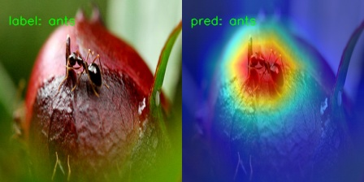
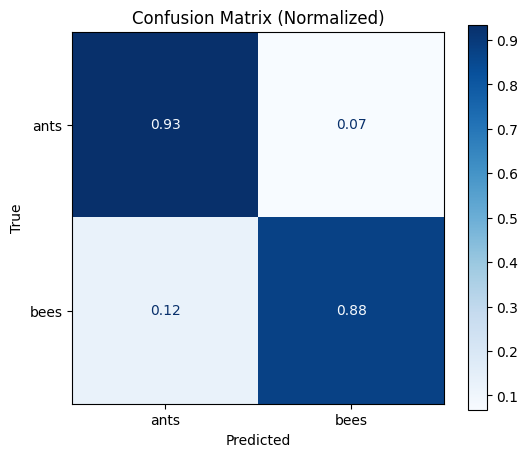

# 🎯 Image Classification Toolkit

A deep learning toolkit for image classification with Gradio interface, featuring model training, Grad-CAM visualization, and comprehensive evaluation metrics.


## ✨ Features

- 🎓 **Multi-Model Support**: ResNet18, EfficientNet-B0, DenseNet121
- 📊 **Real-time Visualization**: Live training curves and batch samples
- 🔥 **Grad-CAM Heatmaps**: Visual explanations for model predictions
- 📈 **Comprehensive Metrics**: Accuracy, Precision, Recall, F1, Confusion Matrix
- ⚡ **Early Stopping**: Prevent overfitting with configurable patience
- 💾 **Automatic Logging**: Training logs and checkpoints saved automatically

## 🚀 Quick Start

### Installation

```bash
# Clone the repository
git clone https://github.com/yourusername/classification-toolkit.git
cd classification-toolkit

# Install dependencies
pip install -r requirements.txt
```

### Dataset Preparation

Organize your dataset in the following structure:

```
datasets/
└── your_dataset/
    ├── train/
    │   ├── class1/
    │   │   ├── img1.jpg
    │   │   └── img2.jpg
    │   └── class2/
    ├── val/
    └── test/
```

### Usage

1. **Split your dataset** (if needed):
```bash
python data_splitting.py
```

2. **Launch the training interface**:
```bash
python main.py
```

3. **Training tab**:
   - Select dataset
   - Choose model architecture
   - Configure hyperparameters
   - Click "Start Training"

4. **Testing tab**:
   - Select trained model
   - Enable heatmap generation (optional)
   - Click "Start Prediction"

## 📁 Project Structure

```
classification-toolkit/
├── main.py                      # Main Gradio application
├── data_splitting.py            # Dataset splitting utility
├── utils/
│   └── classifier_utils.py      # Training/evaluation utilities
├── datasets/                    # Dataset directory
├── checkpoints/                 # Saved models
└── requirements.txt
```

## Sample Results

### Training Curves


### Grad-CAM Heatmaps


### Confusion Matrix


## 🔧 Supported Models

| Model | Parameters | Best For |
|-------|-----------|----------|
| **ResNet18** | 11.7M | Fast training, good baseline |
| **EfficientNet-B0** | 5.3M | Balanced efficiency & accuracy |
| **DenseNet121** | 8.0M | Small datasets, dense connections |

## 📊 Output Files

### Training
- `best_model.pth` - Model with highest validation accuracy
- `final_model.pth` - Model from last epoch
- `loss_acc_plot.png` - Training/validation curves
- `logs/` - Detailed training logs

### Evaluation
- `confusion_matrix.png` - Confusion matrix visualization
- `evaluation_results.txt` - Test metrics summary
- `heatmaps/correct/` - Grad-CAM for correct predictions
- `heatmaps/wrong/` - Grad-CAM for misclassifications

## 🎨 Hyperparameters

Default configuration:
- **Learning Rate**: 0.001
- **Batch Size**: 64
- **Optimizer**: SGD
- **Weight Decay**: 0.0001
- **Early Stop Patience**: 50 epochs

Adjust these in the Gradio interface based on your dataset.

## 🤝 Contributing

Contributions welcome! Please feel free to submit a Pull Request.

## 📝 License

This project is licensed under the MIT License.

## 🙏 Acknowledgments

- [PyTorch](https://pytorch.org/) - Deep learning framework
- [Gradio](https://gradio.app/) - UI framework
- [timm](https://github.com/rwightman/pytorch-image-models) - Pretrained models
- [Grad-CAM](https://arxiv.org/abs/1610.02391) - Visual explanation

---

⭐ **Star this repo if you find it helpful!**